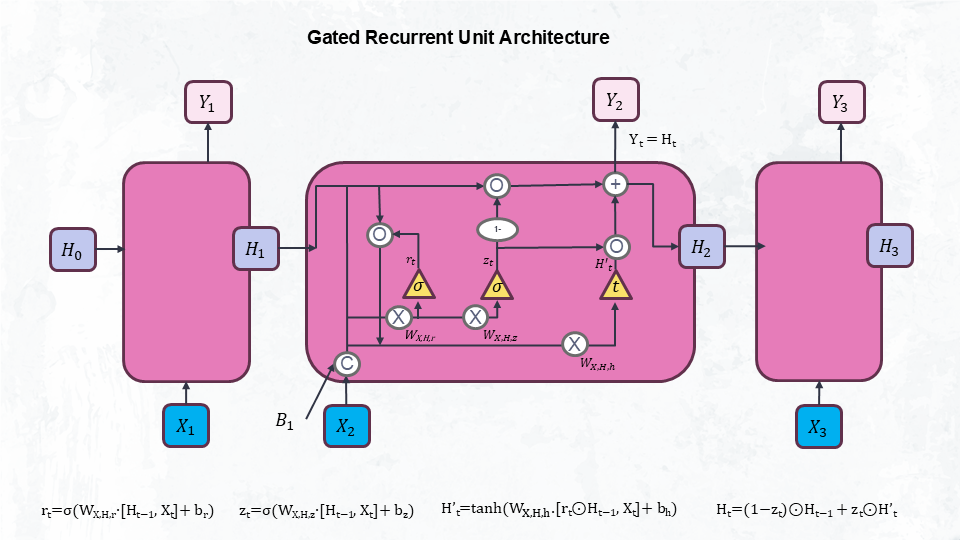

```{r setup, include=FALSE}
knitr::opts_chunk$set(
  echo = TRUE,       
  results = 'hide',  
  warning = FALSE,    
  message = FALSE     
)
```

```{r}
library(data.table)   
library(dplyr)        
library(lubridate)    
library(zoo)
library(tensorflow)
library(keras)
library(tidyverse)

X.standardize <- function(X_train, X_test){
  
  # calculate the values for the mean and standard deviation
  X_mean <- apply(X_train, 2, mean)
  X_sd <- apply(X_train, 2, sd)
  
  # standardize the data
  X_train_std <- scale(X_train, center = X_mean, scale = X_sd)
  X_test_std <- scale(X_test, center = X_mean, scale = X_sd)
  
  return(list(X_train_std, X_test_std))
}

bgd <- function(weights, y, X, hid_n, out_n, nn, costderiv, 
                epochs = 3000, lr = 0.00001, ...){
  
  for(i in 1:epochs){
    
    deriv <- costderiv(weights, y, X, nn, hid_n, out_n, ...)
    
    weights <- weights - lr*deriv
    
  }
  
  return(weights)
  
}
```

# Standard Recurrent Neural Network (RNN)

## Setting up the data

```{r Setting up the data}
#source("C:\\Users\\udwal\\Documents\\Studies_Viadrina\\semester_3\\DeepLearning\\project\\funcs_mlr.R")

csv_files <- list.files(
  #path = "C:\\Users\\udwal\\Documents\\Studies_Viadrina\\semester_3\\DeepLearning\\project\\data_rnn",
  path = "/Users/andrescadena/Library/CloudStorage/OneDrive-europa-uni.de/Deep-NN/Project Task/data_rnn", 
  pattern = "\\.csv$", 
  full.names = TRUE)

# Read and combine all CSV files into one table
combined_data <- rbindlist(
  lapply(csv_files, fread), #fread: Similar to read.table but faster and more convenient. All controls such as sep, colClasses and nrows are automatically detected.
  fill = TRUE, 
  use.names = TRUE)

filtered_data <- combined_data[combined_data$MapCode == "DE_LU", ]

# Convert datetime to POSIXct (UTC timezone)
filtered_data$DateTime <- as.POSIXct(
  filtered_data$DateTime, 
  tz = "UTC"
)

# Define start and end dates
start_date <- as.POSIXct("2018-11-01 00:00:00", tz = "UTC")
end_date <- as.POSIXct("2023-11-30 23:00:00", tz = "UTC")

# Generate complete hourly sequence
full_time_seq <- data.frame(
  DateTime = seq(start_date, end_date, by = "hour")
)

# Merge with complete time sequence
complete_data <- full_time_seq %>% 
  left_join(filtered_data, by = "DateTime") %>% 
  arrange(DateTime)

# Interpolate missing prices linearly
complete_data$Price <- na.approx(complete_data$Price)

# Fill leading/trailing NAs
complete_data$Price <- na.locf(complete_data$Price, na.rm = FALSE)
complete_data$Price <- na.locf(complete_data$Price, fromLast = TRUE, na.rm = FALSE) #To ensure start and end do not have NAs

# Remove duplicate timestamps
complete_data <- complete_data %>% 
  distinct(DateTime, .keep_all = TRUE)

# Verify no missing values
verify <- sum(is.na(complete_data$Price))  #Should return 0
```

## Setting up the independent and dependent variables

```{r Setting up the independent and dependent variables, fig.show='hide'}
lookback <- 24

price_cap <- quantile(complete_data$Price, 0.995, na.rm = TRUE)
complete_data$Price[complete_data$Price > price_cap] <- price_cap #replacing extreme prices with a more reasonable ceiling.

data <- complete_data$Price 

X <- matrix(nrow = length(data) - lookback, ncol = lookback)
Y <- c()

for (i in 1:(length(data) - lookback)) {
  X[i,] <- data[i:(i + lookback - 1)]
  Y[i] <- data[i + lookback]
}

train_size <- floor(0.8 * nrow(X))
x_train <- X[1:train_size, ]
y_train <- Y[1:train_size]
x_test <- X[(train_size + 1):nrow(X), ]
y_test <- Y[(train_size + 1):length(Y)]

standardized_data <- X.standardize(x_train, x_test)
x_train <- standardized_data[[1]]
x_test <- standardized_data[[2]]

y_mean <- mean(y_train)
y_sd <- sd(y_train)
y_train_scaled <- (y_train - y_mean) / y_sd
y_test_scaled  <- (y_test - y_mean) / y_sd

target <- plot(y_train_scaled, type = "l", main = "Target over Time (Standardized)", ylab = "Scaled Price")
abline(h = 0, col = "red", lty = 2)
```

## RNN implementation using a simple architecture

```{r RNN implementation using a simple architecture (many to one RNN)}
# Xavier initialization
rnn.weights.init <- function(input_dim, hidden_dim, output_dim) {
  xavier_limit_xh <- sqrt(6 / (input_dim + hidden_dim))
  W_xh <- matrix(runif(hidden_dim * input_dim, min = -xavier_limit_xh, max = xavier_limit_xh),
                 nrow = hidden_dim, ncol = input_dim)
  
  xavier_limit_hh <- sqrt(6 / (hidden_dim + hidden_dim))
  W_hh <- matrix(runif(hidden_dim * hidden_dim, min = -xavier_limit_hh, max = xavier_limit_hh),
                 nrow = hidden_dim, ncol = hidden_dim)
  
  xavier_limit_hy <- sqrt(6 / (hidden_dim + output_dim))
  W_hy <- matrix(runif(output_dim * hidden_dim, min = -xavier_limit_hy, max = xavier_limit_hy),
                 nrow = output_dim, ncol = hidden_dim)
  
  b_h <- matrix(0, nrow = hidden_dim, ncol = 1)
  b_y <- matrix(0, nrow = output_dim, ncol = 1)
  
  list(W_xh = W_xh, W_hh = W_hh, W_hy = W_hy, b_h = b_h, b_y = b_y)
}

rnn.weights.pack <- function(weights_list) {
  c(as.vector(weights_list$W_xh),
    as.vector(weights_list$W_hh),
    as.vector(weights_list$W_hy),
    as.vector(weights_list$b_h),
    as.vector(weights_list$b_y))
}

rnn.weights.unpack <- function(weights_vector, input_dim, hidden_dim, output_dim) {
  idx <- 0
  
  len_W_xh <- hidden_dim * input_dim
  W_xh <- matrix(weights_vector[(idx + 1):(idx + len_W_xh)], nrow = hidden_dim, ncol = input_dim)
  idx <- idx + len_W_xh
  
  len_W_hh <- hidden_dim * hidden_dim
  W_hh <- matrix(weights_vector[(idx + 1):(idx + len_W_hh)], nrow = hidden_dim, ncol = hidden_dim)
  idx <- idx + len_W_hh
  
  len_W_hy <- output_dim * hidden_dim
  W_hy <- matrix(weights_vector[(idx + 1):(idx + len_W_hy)], nrow = output_dim, ncol = hidden_dim)
  idx <- idx + len_W_hy
  
  len_b_h <- hidden_dim
  b_h <- matrix(weights_vector[(idx + 1):(idx + len_b_h)], nrow = hidden_dim, ncol = 1)
  idx <- idx + len_b_h
  
  len_b_y <- output_dim
  b_y <- matrix(weights_vector[(idx + 1):(idx + len_b_y)], nrow = output_dim, ncol = 1)
  
  list(W_xh = W_xh, W_hh = W_hh, W_hy = W_hy, b_h = b_h, b_y = b_y)
}


# Tanh activation
rnn_forward <- function(x_sequence, weights, h_prev = NULL) {
  W_xh <- weights$W_xh
  W_hh <- weights$W_hh
  W_hy <- weights$W_hy
  b_h <- weights$b_h
  b_y <- weights$b_y
  
  hidden_dim <- nrow(W_hh)
  input_dim <- ncol(W_xh)
  sequence_length <- length(x_sequence)
  
  if (is.null(h_prev)) {
    h_prev <- matrix(0, nrow = hidden_dim, ncol = 1)
  }
  
  hidden_states <- vector("list", sequence_length)
  input_values_at_t <- vector("list", sequence_length)
  net_inputs_at_t <- vector("list", sequence_length)
  
  for (t in 1:sequence_length) {
    x_t <- matrix(x_sequence[t], nrow = input_dim, ncol = 1)
    input_values_at_t[[t]] <- x_t
    
    net_h <- W_xh %*% x_t + W_hh %*% h_prev + b_h
    net_inputs_at_t[[t]] <- net_h
    
    h_t <- tanh(net_h)
    
    hidden_states[[t]] <- h_t
    h_prev <- h_t
  }
  
  net_o <- W_hy %*% h_prev + b_y
  y_hat <- as.numeric(net_o)
  
  return(list(
    y_hat = y_hat,
    hidden_states = hidden_states,
    input_values_at_t = input_values_at_t,
    net_inputs_at_t = net_inputs_at_t
  ))
}

rnn_bptt <- function(y_true, forward_result, weights) {
  net_inputs <- forward_result$net_inputs_at_t
  y_hat <- forward_result$y_hat
  H <- forward_result$hidden_states
  X <- forward_result$input_values_at_t
  
  W_xh <- weights$W_xh
  W_hh <- weights$W_hh
  W_hy <- weights$W_hy
  
  hidden_dim <- nrow(W_hh)
  input_dim <- ncol(W_xh)
  output_dim <- nrow(W_hy)
  T_seq_len <- length(H)
  
  dW_xh <- matrix(0, nrow = hidden_dim, ncol = input_dim)
  dW_hh <- matrix(0, nrow = hidden_dim, ncol = hidden_dim)
  dW_hy <- matrix(0, nrow = output_dim, ncol = hidden_dim)
  db_h <- matrix(0, nrow = hidden_dim, ncol = 1)
  db_y <- matrix(0, nrow = output_dim, ncol = 1)
  
  delta_o <- y_hat - y_true
  
  h_T <- H[[T_seq_len]]
  dW_hy <- delta_o %*% t(h_T)
  db_y <- delta_o
  
  dL_dh_from_next <- matrix(0, nrow = hidden_dim, ncol = 1)
  
  for (t in T_seq_len:1) {
    h_t <- H[[t]]
    x_t <- X[[t]]
    h_prev_for_t <- if (t == 1) matrix(0, nrow = hidden_dim, ncol = 1) else H[[t-1]]
    
    dL_dh_t_total <- dL_dh_from_next
    if (t == T_seq_len) {
      dL_dh_t_total <- dL_dh_t_total + (t(W_hy) %*% delta_o)
    }
    
    net_h <- net_inputs[[t]]
    tanh_derivative <- 1 - (tanh(net_h))^2
    delta_net_h <- dL_dh_t_total * tanh_derivative
    
    dW_xh <- dW_xh + delta_net_h %*% t(x_t)
    dW_hh <- dW_hh + delta_net_h %*% t(h_prev_for_t)
    db_h <- db_h + delta_net_h
    
    dL_dh_from_next <- t(W_hh) %*% delta_net_h
  }
  
  return(list(dW_xh = dW_xh, dW_hh = dW_hh, dW_hy = dW_hy, db_h = db_h, db_y = db_y))
}


rnn_update_weights <- function(weights, grads, learning_rate) {
  weights$W_xh <- weights$W_xh - learning_rate * grads$dW_xh
  weights$W_hh <- weights$W_hh - learning_rate * grads$dW_hh
  weights$W_hy <- weights$W_hy - learning_rate * grads$dW_hy
  weights$b_h <- weights$b_h - learning_rate * grads$db_h
  weights$b_y <- weights$b_y - learning_rate * grads$db_y
  return(weights)
}

rnn.cost.derivative.batch <- function(flat_weights, y, X, nn, hid_n, out_n, input_dim, h_initial_overall = NULL) {
  
  # Unpack flat weights into matrices/vectors
  weights <- rnn.weights.unpack(flat_weights, input_dim, hid_n, out_n)
  
  num_samples <- nrow(X)
  
  # Initialize total gradients as zero matrices/vectors
  total_dW_xh <- matrix(0, nrow = hid_n, ncol = input_dim)
  total_dW_hh <- matrix(0, nrow = hid_n, ncol = hid_n)
  total_dW_hy <- matrix(0, nrow = out_n, ncol = hid_n)
  total_db_h <- matrix(0, nrow = hid_n, ncol = 1)
  total_db_y <- matrix(0, nrow = out_n, ncol = 1)
  
  for (i in 1:num_samples) {
    x_seq <- X[i, ]
    y_true_val <- y[i]
    
    # Forward pass for sample i
    forward_out <- rnn_forward(x_seq, weights, h_prev = h_initial_overall)
    
    # Backpropagation for sample i
    grads <- rnn_bptt(y_true_val, forward_out, weights)
    
    # Accumulate gradients
    total_dW_xh <- total_dW_xh + grads$dW_xh
    total_dW_hh <- total_dW_hh + grads$dW_hh
    total_dW_hy <- total_dW_hy + grads$dW_hy
    total_db_h <- total_db_h + grads$db_h
    total_db_y <- total_db_y + grads$db_y
  }
  
  # Pack total gradients into flat vector (to match flat_weights shape)
  packed_gradients <- rnn.weights.pack(list(
    W_xh = total_dW_xh,
    W_hh = total_dW_hh,
    W_hy = total_dW_hy,
    b_h = total_db_h,
    b_y = total_db_y
  ))
  
  return(packed_gradients)
}

rnn_predict_for_bgd_wrapper <- function(flat_weights, X, hid_n, out_n, input_dim, h_initial_overall = NULL) {
  
  # Unpack weights vector into matrices
  weights <- rnn.weights.unpack(flat_weights, input_dim, hid_n, out_n)
  
  num_samples <- nrow(X)
  y_preds <- numeric(num_samples)
  
  # Loop over all sequences in X
  for (i in 1:num_samples) {
    # Run forward pass for each input sequence
    forward_out <- rnn_forward(X[i, ], weights, h_prev = h_initial_overall)
    y_preds[i] <- forward_out$y_hat
  }
  
  # Return list containing predictions vector
  return(list(y_est = y_preds))
}
```

## Training Vs. Validation

```{r Training Vs. Validation, eval=FALSE, include=TRUE}
input_dim <- 1  
hidden_dim <- 16
output_dim <- 1

set.seed(1234)
initial_weights_list <- rnn.weights.init(input_dim, hidden_dim, output_dim)
trained_weights <- rnn.weights.pack(initial_weights_list)

train_losses <- c()
val_losses <- c()

for (epoch in 1:100) {
  
  # 1) Update weights by performing one BGD step here
  trained_weights <- bgd(
    weights = trained_weights,
    y = y_train_scaled,
    X = x_train,
    hid_n = hidden_dim,
    out_n = output_dim,
    nn = rnn_predict_for_bgd_wrapper,
    costderiv = rnn.cost.derivative.batch,
    epochs = 1,
    lr = 0.00001,
    input_dim = input_dim
  )
  
  # 2) Predict on train set with current weights
  train_preds_scaled <- rnn_predict_for_bgd_wrapper(
    flat_weights = trained_weights,
    X = x_train,
    hid_n = 16,
    out_n = 1,
    input_dim = 1
  )$y_est
  
  # 3) Calculate training loss (MSE)
  train_loss <- mean((train_preds_scaled - y_train_scaled)^2)
  train_losses <- c(train_losses, train_loss)
  
  # 4) Predict on validation/test set with current weights
  val_preds_scaled <- rnn_predict_for_bgd_wrapper(
    flat_weights = trained_weights,
    X = x_test,
    hid_n = 16,
    out_n = 1,
    input_dim = 1
  )$y_est
  
  # 5) Calculate validation loss (MSE)
  val_loss <- mean((val_preds_scaled - y_test_scaled)^2)
  val_losses <- c(val_losses, val_loss)
  
  if (epoch %% 10 == 0) {
    cat(sprintf("Epoch %d: Train Loss = %.4f | Val Loss = %.4f\n", epoch, train_loss, val_loss))
  }
}

loss_df <- tibble(
  Epoch = rep(1:length(train_losses), times = 2),
  Loss = c(train_losses, val_losses),
  Type = rep(c("Train", "Validation"), each = length(train_losses))
)

ggplot(loss_df, aes(x = Epoch, y = Loss, color = Type)) +
  geom_line(size = 1.2) +
  labs(title = "Train vs Validation MSE Loss", y = "MSE", x = "Epoch") +
  theme_minimal(base_size = 14)
```

## Checking gradients

```{r Checking gradients}
# Forward pass and loss for Wx
fwd_Wx <- function(Wx, H_prev, X_t, Y_t, Wh, Wo) {
  Z_t <- Wh * H_prev + Wx * X_t
  H_t <- tanh(Z_t)
  Y_pred <- Wo * H_t
  L <- 0.5 * (Y_pred - Y_t)^2
  return(as.numeric(L))
}

# Analytical gradient dL/dWx
analytical_grad_Wx <- function(Wx, H_prev, X_t, Y_t, Wh, Wo) {
  Z_t <- Wh * H_prev + Wx * X_t
  H_t <- tanh(Z_t)
  Y_pred <- Wo * H_t
  
  dL_dYpred <- Y_pred - Y_t
  dYpred_dHt <- Wo
  dHt_dZt <- 1 - tanh(Z_t)^2
  dZt_dWx <- X_t
  
  return(dL_dYpred * dYpred_dHt * dHt_dZt * dZt_dWx)
}

# Forward pass and loss for Wo
fwd_Wo <- function(Wo, H_prev, X_t, Y_t, Wh, Wx) {
  Z_t <- Wh * H_prev + Wx * X_t
  H_t <- tanh(Z_t)
  Y_pred <- Wo * H_t
  L <- 0.5 * (Y_pred - Y_t)^2
  return(as.numeric(L))
}

# Analytical gradient dL/dWo
analytical_grad_Wo <- function(Wo, H_prev, X_t, Y_t, Wh, Wx) {
  Z_t <- Wh * H_prev + Wx * X_t
  H_t <- tanh(Z_t)
  Y_pred <- Wo * H_t
  
  dL_dYpred <- Y_pred - Y_t
  dYpred_dWo <- H_t
  
  return(dL_dYpred * dYpred_dWo)
}

# Numerical gradient via finite differences
numerical_grad <- function(param, f, eps = 1e-5) {
  f_plus  <- f(param + eps)
  f_minus <- f(param - eps)
  return((f_plus - f_minus) / (2 * eps))
}

# Example fixed values
Wh <- 0.5; Wx <- 0.3; Wo <- 0.7
H_prev <- 0.1; X_t <- 0.2; Y_t <- 0.05

# Check Wx gradient
num_grad_Wx <- numerical_grad(Wx, function(w) fwd_Wx(w, H_prev, X_t, Y_t, Wh, Wo))
ana_grad_Wx <- analytical_grad_Wx(Wx, H_prev, X_t, Y_t, Wh, Wo)
cat("Wx numerical gradient:", num_grad_Wx, "\n")
cat("Wx analytical gradient:", ana_grad_Wx, "\n\n")

# Check Wo gradient
num_grad_Wo <- numerical_grad(Wo, function(w) fwd_Wo(w, H_prev, X_t, Y_t, Wh, Wx))
ana_grad_Wo <- analytical_grad_Wo(Wo, H_prev, X_t, Y_t, Wh, Wx)
cat("Wo numerical gradient:", num_grad_Wo, "\n")
cat("Wo analytical gradient:", ana_grad_Wo, "\n")
```

## Biggest challenge I

One of the biggest challenges we faced was debugging, especially to know how to deal with vanishing and exploding gradients. Initially, our model was getting either exploding gradients or vanishing ones. To address this, we started to experiment with different activation and initialization functions. At first, we tried using ReLU activation function with He initialization, as we remembered from the tutorials that those were widely recommended functions to use nowadays. However, as the professor constantly emphasized, the algorithms and functions used are also problem dependent. You must try which one works the best for your specific data and task.

After doing some research, we got to the conclusion that when dealing with negative values Tanh was more appropriate as an activation function. Along with it, we applied Xavier initialization. This change was groundbreaking; we immediately saw a huge improvement in performance.

Nevertheless, our MSE remained around thousands, which was far from acceptable. This led us to look the data closely again. At the beginning, we identified some outliers, but we underestimated their impact. On closer inspection, we realized these extreme values might be harming the training process. We then tried a strategy that AI recommended us: capping the outliers (replacing extreme prices with a more reasonable ceiling). This was indeed a game-changer, since we were able to achieve a really low MSE, or at least one acceptable compared to our initial attempts.

## Use of AI I

AI played a critical role to debug in helping us to debug the model. It is often hard to check every detail of the code manually, but AI was able to read everything quickly and identify possible errors in seconds.

However, AI required clear contextual information as sometimes it was pointing out errors that were not present. For example, when we asked for help improving model performance, the AI mainly focused on changes in activation functions, initialization or optimization algorithms.

We had to clarify that we wanted suggestions related on how to deal with the data, and not with the model architecture. Once we did that, we got the capping strategy, which was incredible helpful.

This experience taught us that AI is a powerful assistant, but one that need much and clear information. So, the user is the guidance and the one that must filter its suggestions using acquired knowledge and critical thinking.

For training the TensorFlow model, we used **Google AI Studio**, which provided access to **Gemini 2.5 Pro Preview (05.06)**. This tool was helpful in identifying potential issues early and suggesting possible solutions throughout the development process.

However, we observed that while the AI could be insightful, it sometimes proposed overly complex solutions to problems that could be resolved with simple adjustments, for example, by just modifying the weight initialization instead of changing the entire model architecture.

We used prompts such as:

> "My goal is to replicate the standard RNN model in TensorFlow as closely as possible. What are the potential parameters or functions that might create significant differences?"

This helped us focus on parameters like weight shapes, loss function definitions, input tensor formats, and gradient behavior that could cause divergence between the R and TensorFlow implementations.


# Tensorflow's Recurrent Neural Network (RNN)

## TensorFlow model definition and manual weight setting

```{r}

input_dim_R <- 1    
hidden_dim_R <- 16  
output_dim_R <- 1
seed_R <- 1234

set.seed(seed_R)

# Calling rnn.weights.init function from proejct_a1:
initial_weights_list_R <- rnn.weights.init(
  input_dim = input_dim_R,
  hidden_dim = hidden_dim_R,
  output_dim = output_dim_R
)


# Hyperparameters for TensorFlow model (matching R)
tf_input_timesteps <- 24
tf_input_features  <- 1
tf_hidden_units    <- 16
tf_output_units    <- 1

# Model buidling without initilization
model_tf_manual_weights <- keras_model_sequential(name = "tf_rnn_manual_weights")
model_tf_manual_weights %>%
  layer_simple_rnn(
    units = tf_hidden_units,
    activation = 'tanh',
    input_shape = c(tf_input_timesteps, tf_input_features),
    use_bias = TRUE,
    name = "simple_rnn_layer_manual" # No initializers specified; we set weights manually
  ) %>%
  layer_dense(
    units = tf_output_units,
    activation = 'linear',
    use_bias = TRUE,
    name = "output_layer_manual"
  )

# --- Note: project_a1 needs to be added to the environment --

# Prepare R weights for TensorFlow Keras format

# kernel: x→h
tf_W_xh_from_R <- array_reshape(
  t(initial_weights_list_R$W_xh),                      # transpose to (1 × 16)
  dim = c(tf_input_features, tf_hidden_units)          # 1 × 16
)

# recurrent_kernel: h→h 
tf_W_hh_from_R <- array_reshape(
  initial_weights_list_R$W_hh,                         # already 16 × 16 in R
  dim = c(tf_hidden_units, tf_hidden_units)            # 16 × 16
)

# bias (hidden)
tf_b_h_from_R <- as.numeric(initial_weights_list_R$b_h) # bias in R (16 zeros) travels intact into TensorFlow
if (length(tf_b_h_from_R) == 1)                           
  tf_b_h_from_R <- rep(tf_b_h_from_R, tf_hidden_units)    
tf_b_h_from_R <- array_reshape(tf_b_h_from_R, dim = c(tf_hidden_units))

# kernel: h→y
tf_W_hy_from_R <- array_reshape(
  t(initial_weights_list_R$W_hy),                      # transpose to 16 × 1
  dim = c(tf_hidden_units, tf_output_units)            # 16 × 1
)

# bias (output)
tf_b_y_from_R <- array_reshape(
  as.numeric(initial_weights_list_R$b_y),              # make 1-vector
  dim = c(tf_output_units)                             # length 1
)

# Build the model by calling it with a dummy input: to trigger model building before manually setting weights
dummy_input_shape <- c(1L, as.integer(tf_input_timesteps), as.integer(tf_input_features))
dummy_input <- tf$zeros(shape = dummy_input_shape, dtype = tf$float32)
invisible(model_tf_manual_weights(dummy_input)) # Builds the model layers

# Set the prepared R weights into the TensorFlow Model
rnn_layer_tf <- get_layer(model_tf_manual_weights, name = "simple_rnn_layer_manual")
set_weights(rnn_layer_tf, list(tf_W_xh_from_R, tf_W_hh_from_R, tf_b_h_from_R))

output_layer_tf <- get_layer(model_tf_manual_weights, name = "output_layer_manual")
set_weights(output_layer_tf, list(tf_W_hy_from_R, tf_b_y_from_R))

print("TensorFlow model defined and weights manually set from R initial weights.")
summary(model_tf_manual_weights)
```

## Reshape input data for TensorFlow and compiling

```{r}
num_train_samples <- nrow(x_train)
x_train_tf <- array_reshape(x_train, c(num_train_samples, lookback, 1))
y_train_scaled_tf <- as.matrix(y_train_scaled)

num_val_samples <- nrow(x_test)
x_test_tf <- array_reshape(x_test, c(num_val_samples, lookback, 1))
y_val_scaled_tf <- as.matrix(y_test_scaled)


#Define Optimizer and Loss Functions
tf_learning_rate <- 0.00001 # same as R

optimizer_tf <- tf$keras$optimizers$SGD(learning_rate = tf_learning_rate)

# Custom loss: SUM (0.5 * (y_true - y_pred)^2) for gradient calculation
custom_loss_tf_sum_half_mse <- function(y_true, y_pred) {
  squared_difference <- tf$square(y_true - y_pred)
  sum_half_squared_difference <- tf$reduce_sum(0.5 * squared_difference)
  return(sum_half_squared_difference)
}

# Standard MSE for reporting
loss_fn_tf_reporting_mean_mse <- tf$keras$losses$MeanSquaredError()

```

## TensorFlow BGD training loop

```{r, fig.show='hide'}

# Custom Training Step Function
train_step_tf <- function(model, optimizer, x_batch, y_batch, loss_for_grads_fn) {
  with(tf$GradientTape() %as% tape, {
    predictions <- model(x_batch, training = TRUE)
    loss_value_for_grads <- loss_for_grads_fn(y_batch, predictions)
  })
  grads <- tape$gradient(loss_value_for_grads, model$trainable_variables)
  
  optimizer$apply_gradients(zip_lists(grads, model$trainable_variables))
  return(loss_value_for_grads)
}


tf_epochs <- 100 # same as R

# For storing losses and initial gradients
tf_train_custom_sum_loss_epoch <- numeric(tf_epochs)
tf_train_reported_mse_epoch    <- numeric(tf_epochs)
tf_val_reported_mse_epoch      <- numeric(tf_epochs)
initial_summed_grads_tf_list   <- NULL


plot(1, type="n", xlim=c(1, tf_epochs), ylim=c(0, 1), 
     xlab="Epoch", ylab="MSE", main="Training vs Validation MSE")
legend("topright", legend=c("Train MSE", "Val MSE"), col=c("blue", "red"), lty=1)

print("Starting TensorFlow BGD Training (with manually set R initial weights)...")
for (epoch in 1:tf_epochs) {
  # Training step
  current_epoch_sum_loss <- train_step_tf(
    model_tf_manual_weights,
    optimizer_tf,
    x_train_tf,
    y_train_scaled_tf,
    custom_loss_tf_sum_half_mse
  )
  tf_train_custom_sum_loss_epoch[epoch] <- as.numeric(current_epoch_sum_loss)
  
  # MSE for train/val
  train_preds_tf_epoch <- model_tf_manual_weights(x_train_tf, training = FALSE)
  current_train_mse <- loss_fn_tf_reporting_mean_mse(y_train_scaled_tf, train_preds_tf_epoch)
  tf_train_reported_mse_epoch[epoch] <- as.numeric(current_train_mse)
  
  val_preds_tf_epoch <- model_tf_manual_weights(x_test_tf, training = FALSE)
  current_val_mse <- loss_fn_tf_reporting_mean_mse(y_val_scaled_tf, val_preds_tf_epoch)
  tf_val_reported_mse_epoch[epoch] <- as.numeric(current_val_mse)
  
  # live plotting every 5 epochs
  if (epoch %% 5 == 0 || epoch == 1) {
    lines(1:epoch, tf_train_reported_mse_epoch[1:epoch], type="l", col="blue")
    lines(1:epoch, tf_val_reported_mse_epoch[1:epoch], type="l", col="red")
  }
  
  # Console progress
  if (epoch %% 10 == 0 || epoch == 1) {
    cat(sprintf("TF Epoch %d: Train = %.6f, Val = %.6f\n",
                epoch, current_train_mse, current_val_mse))
    
    loss_val_numeric <- as.numeric(current_epoch_sum_loss)
    if (is.nan(loss_val_numeric) || is.infinite(loss_val_numeric)) {
      print("EXPLODING GRADIENTS DETECTED IN TENSORFLOW (NaN/Inf loss)!")
      print("Consider adding gradient clipping inside train_step_tf function.")
      break
    }
  }
}

```

## Biggest challenge II

## Achieving similar results in tensorFlow compared to the standard RNN in R

Reproducing the behavior of a standard RNN implemented in R using TensorFlow required several key adjustments. Understanding how the R-based RNN achieved its loss values—and what computational assumptions it made—was crucial for aligning TensorFlow's setup accordingly.

-   **Weight import:**\
    Although we initialized the weights in TensorFlow using the same seed and structure, the model's performance initially differed significantly from the R implementation. To resolve this, we directly imported the R-initialized weights into the TensorFlow model, ensuring both models started from the exact same parameters.

-   **Sum of gradients:**\
    In our custom R training loop, gradients are computed based on the **sum** of the loss across all samples (as is typical in Batch Gradient Descent). By contrast, TensorFlow defaults to using the **mean**. To match the R behavior, we implemented a custom loss function in TensorFlow that preserved the summed gradient behavior.

-   **Loss function definition:**\
    Our course defined the loss as $0.5 \times (y_{\text{true}} - \hat{y})^2$, whereas TensorFlow's built-in loss functions typically compute the mean squared error $\text{mean}((y_{\text{true}} - y_{\text{pred}})^2)$. We addressed this mismatch by defining a custom loss function in TensorFlow that explicitly matched the R formulation.

-   **TensorFlow input format:**\
    In R, the input data was shaped as `(samples, timesteps)`. However, TensorFlow expects RNN input in the format `(samples, timesteps, features)`. We resolved this discrepancy by explicitly reshaping the input arrays before feeding them into the TensorFlow model.

# GRU diagram creation

## GRU diagram




## GRU diagram creation challenges

The biggest challenge in creating the GRU diagram was understanding how the GRU actually works. To do this effectively, we first needed to understand how LSTM functions and what the course-provided LSTM diagram truly represented.

While researching GRUs, we encountered many variations in diagrams and notations across different sources. The lack of a universal standard for GRU diagrams created confusion. Ultimately, this challenge was resolved by focusing on the **formulas** rather than the visuals, and by consistently using the **notation introduced in our course’s LSTM diagram** for clarity and consistency.

## Use of AI II

The use of AI tools for this section was significantly lower compared to previous parts of the project. Tools like ChatGPT were helpful for textual explanations but not ideal for generating or explaining complex diagrams such as GRU architectures.

Instead, we relied more on **video-based explanations** and **research papers with R code examples**. AI was mainly used to:

- Get general overviews of GRU.
- Confirm our understanding of theoretical concepts.
- Clarify differences in terminology and notation across sources.


# Overall reflection


